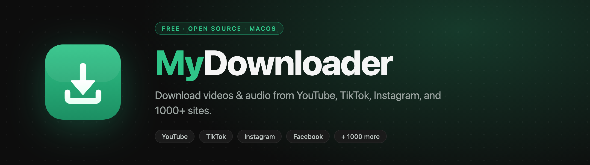

<p align="center">
  
</p>

<p align="center">
  <a href="https://github.com/chrisphua/MyDownloader/releases/latest"></a>
  <a href="./LICENSE"></a>
  
  <a href="https://github.com/sponsors/chrisphua"></a>
</p>

# MyDownloader

A free, open-source, self-contained video downloader for macOS. Paste a link
from YouTube, TikTok, Instagram, Facebook, and 1000+ other sites — get an MP3
or MP4 saved straight to your Mac. No account, no server, no installs.

**🌐 Landing page:** https://chrisphua.github.io/MyDownloader/
**⬇️ Download:** https://github.com/chrisphua/MyDownloader/releases/latest

## Features

- Download from YouTube, TikTok, Instagram, Facebook, Twitter/X, SoundCloud,
  Vimeo, and 1000+ other sites (via [yt-dlp](https://github.com/yt-dlp/yt-dlp))
- MP3 (audio) or MP4 (video) with resolution control
- Fully self-contained — `yt-dlp` and `ffmpeg` are bundled inside the app
- Runs entirely on your Mac; nothing is sent to any server
- Native Apple Silicon (ARM64) build

## Install

1. Download the latest `.zip` from the [Releases page](https://github.com/chrisphua/MyDownloader/releases/latest)
2. Unzip it and drag **MyDownloader.app** to your Applications folder
3. Open it, paste a video URL, pick a format, and download

> **First launch:** the app is unsigned, so macOS Gatekeeper may warn that it's
> from an unidentified developer. Right-click the app → **Open**, then confirm.

## Architecture

Single Electron app — no server, no cloud.

```
apps/desktop/
  binaries/       yt-dlp + ffmpeg ARM64 binaries (gitignored)
  src/
    main.ts       Electron main process; spawns yt-dlp/ffmpeg via IPC
    preload.ts    exposes IPC channels to the renderer
    App.tsx       React UI
    renderer.tsx  React root
    index.css     styles
  forge.config.ts Electron Forge config; bundles the binaries
docs/             GitHub Pages landing page
```

**How it works:** you paste a URL → the renderer calls
`window.electron.startDownload()` → the main process spawns the bundled `yt-dlp`
(using the bundled `ffmpeg` for muxing/conversion) → progress is streamed back
over IPC → a native Save dialog appears when the download finishes.

## Development

```bash
# Install dependencies
cd apps/desktop && npm install

# Download bundled yt-dlp + ffmpeg binaries (run once before building)
npm run download-binaries

# Run in dev mode
npm start

# Build the installable .zip for Apple Silicon
npm run make:mac
```

Build output: `apps/desktop/out/make/zip/darwin/arm64/MyDownloader-darwin-arm64-*.zip`

## Releasing

```bash
# 1. Build
npm run make:mac

# 2. Create a GitHub Release with the zip attached
gh release create vX.Y.Z \
  apps/desktop/out/make/zip/darwin/arm64/MyDownloader-darwin-arm64-*.zip \
  --repo chrisphua/MyDownloader --title "MyDownloader vX.Y.Z" --notes "..."
```

The landing page's download buttons point at `releases/latest/download/...`, so
they always resolve to the newest release without editing the HTML.

## Support

MyDownloader is free and open source. If it's useful to you, consider
[sponsoring on GitHub](https://github.com/sponsors/chrisphua) — it helps cover
maintenance and keeps the project free for everyone. 💚

## Disclaimer

**This software is a tool. You are solely responsible for how you use it.**

- MyDownloader is provided for **personal, lawful use only** — for example,
  downloading content you own, content in the public domain, or content you
  have explicit permission to download.
- **The author and contributors take no responsibility for any misuse** of this
  software, nor for any content downloaded with it.
- Downloading copyrighted material without the rights holder's permission may
  violate the terms of service of the source platform and/or the copyright laws
  of your country. Respecting those terms and laws is **your responsibility**.
- **All downloaded content belongs to its respective owners.** This software
  does not grant you any rights to any content. You must ensure you have the
  legal right to download and use any content you obtain with it.
- The software is provided **"as is", without warranty of any kind**. The author
  is not liable for any damages, data loss, or legal consequences arising from
  its use. See [LICENSE](./LICENSE) for the full terms.

By downloading or using MyDownloader, you agree that you understand and accept
these terms and that you will comply with all applicable laws and the terms of
service of any platform you download from.

## License

[MIT](./LICENSE) © 2026 Chris Phua

Bundled third-party components retain their own licenses:
[yt-dlp](https://github.com/yt-dlp/yt-dlp/blob/master/LICENSE) (Unlicense) and
[ffmpeg](https://ffmpeg.org/legal.html) (LGPL/GPL).
